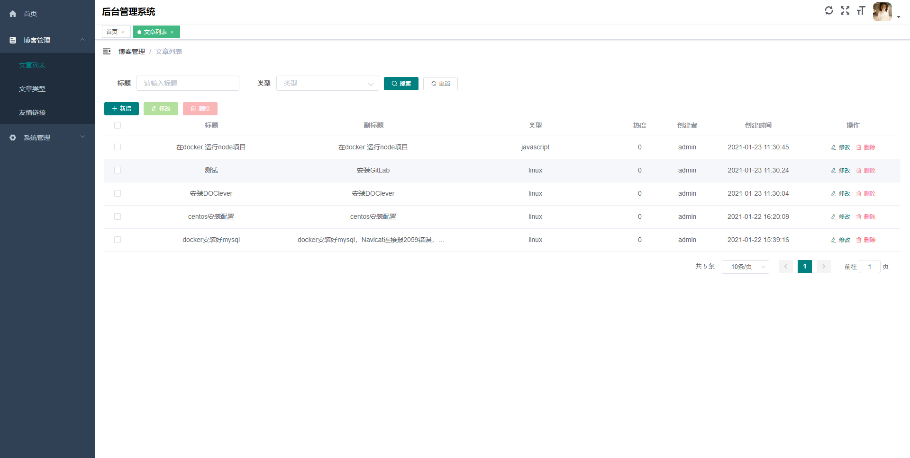
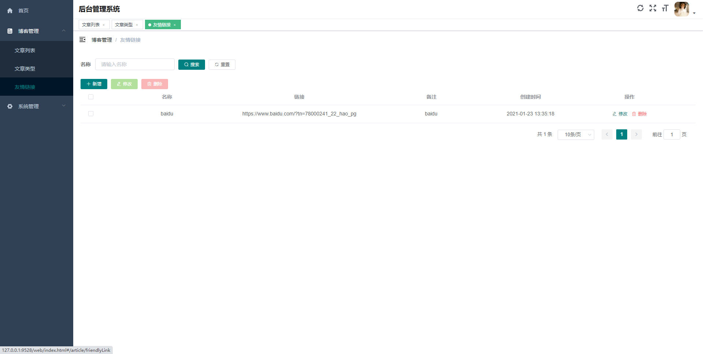

# vue-cms

## 描述

cms-api 为前后端分离的博客管理系统。

## 技术栈

后端技术栈：egg.js + mysql + sequelize + jwt 等

前端技术栈：vue全家桶 + axios + elementUI + markdown编辑器等

后端项目地址：https://github.com/caiheping/egg-cms

## 项目运行

### 后端项目运行

请移到：https://github.com/caiheping/egg-cms

### 前端项目运行

> git clone https://github.com/caiheping/vue-cms.git
>
> 如果clone代码慢可以clone码云的仓库
>
> git clone https://gitee.com/caiheping/vue-cms.git
>
> cd ./vue-cms
>
> npm install
>
> npm run serve

## 项目功能

- [x] 登录 -- 完成
- [x] 首页 -- 去我的博客
- [x] 文章列表 -- 增删改查
- [x] 文章类型 -- 增删改查
- [x] 用户中心 -- 增删改查
- [x] 角色管理 -- 增删改查
- [x] 菜单管理 -- 增删改查
- [x] 部门管理 -- 增删改查
- [x] 通知公告 -- 增删改查
- [x] 头像上传 -- 完成
- [x] 我的博客前端界面（知道地址后无需登录就可以进入）

### 目录结构

演示地址：http://blog.caihp.top （自己服务器只开放部分功能，想要查看全部功能，请copy代码在自己的电脑上看）

用户名： test

密码：123456

## 界面截图

**登录页**

**首页**

**博客管理 > 文章列表**

**博客管理 > 文章类型**

**博客管理 > 友情链接**

**系统管理 > 用户管理**

**系统管理 > 角色管理**

**系统管理 > 菜单管理**

**系统管理 > 部门管理**

**系统管理 > 字典管理**

**系统管理 > 通知公告**

**我的博客 > 首页**

**我的博客 > 文章详情**

如果对您有帮助，您可以点右上角 "Star" 支持一下 谢谢！ ^_^
